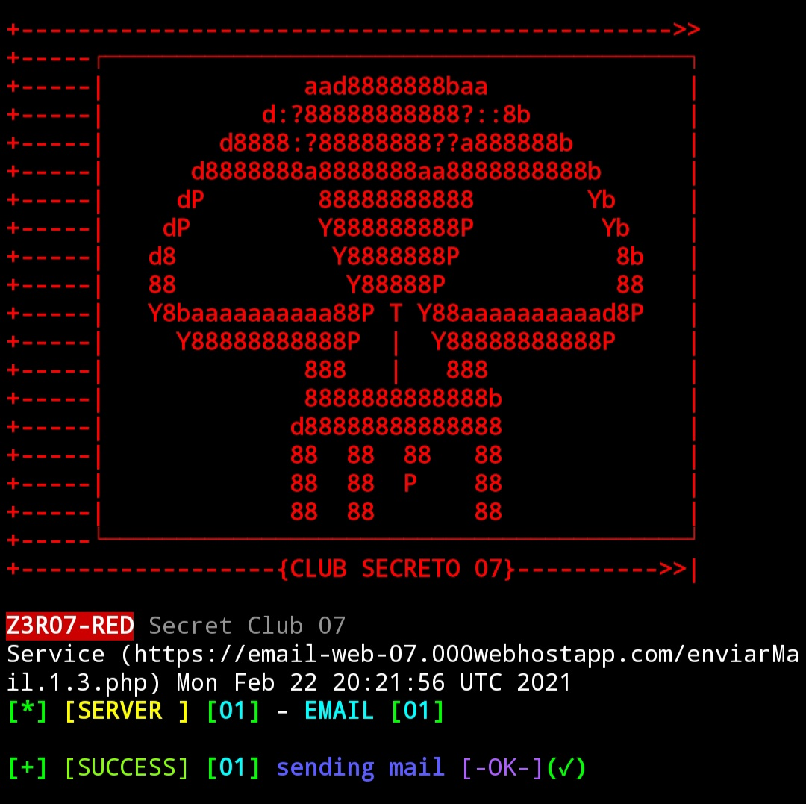
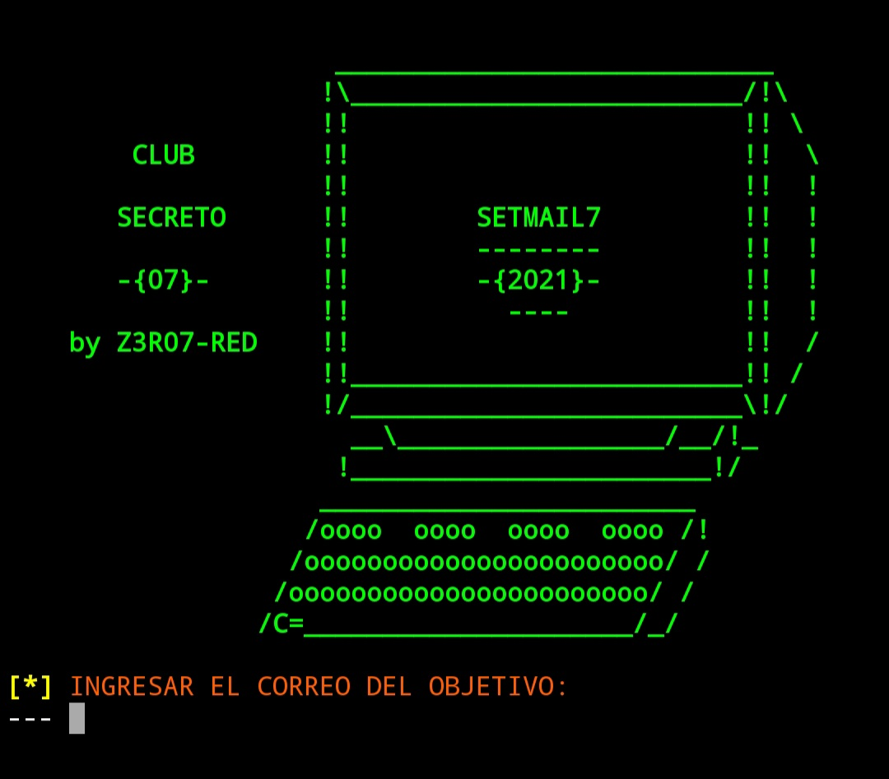

SETMAIL7 es una herramienta para enviar correos electrónicos de forma automática, para realizar pruebas de seguridad. Úselo en un ambiente controlado. No soy responsable del mal uso que le den; todos son responsables de sus acciones.

COMPATIBLE
======

* Es Compatible con `Termux` y `Kali linux`.

<p align="center">

</p>

DESCARGAR:
======

```
git clone https://github.com/Z3R07-RED/SETMAIL7.git
```

USAR:
======

```
cd SETMAIL7/
```

```
chmod +x SETMAIL7.sh
```

```
bash SETMAIL7.sh
```

<p align="center">

</p>
